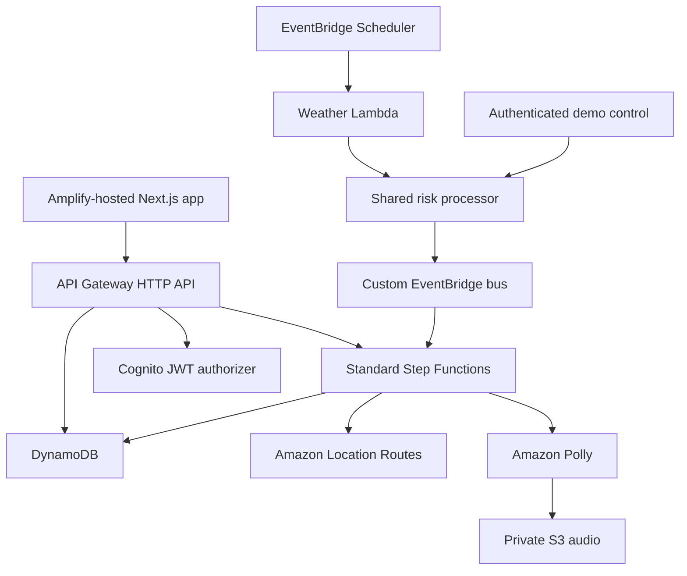

# TaapSaathi — Heat Safety and Intelligent Dispatch

TaapSaathi is an AWS-native demonstration that detects heat risk for delivery workers, delivers bilingual safety guidance, waits for a human response, and safely reassigns or escalates active work. The public frontend and backend are deployed, the critical AWS workflows are verified, and the final open acceptance gate is three-role Cognito browser evidence.

- Public demo: <https://main.d6hf0wv24qbik.amplifyapp.com>
- API: <https://fkysuwgzb8.execute-api.ap-south-1.amazonaws.com>
- [Current project status](docs/PROJECT_STATUS.md)
- [AWS verification evidence](docs/AWS_VERIFICATION_EVIDENCE.md)
- [Three-minute judge demo runbook](docs/JUDGE_DEMO_RUNBOOK.md)
- [Deployment runbook](docs/DEPLOYMENT_RUNBOOK.md)

## What the demo proves

1. An operator triggers a labelled heat spike.
2. The same deterministic risk path used by scheduled observations publishes a versioned EventBridge event.
3. Standard Step Functions creates a durable intervention.
4. Amazon Location and Polly prepare route and audio guidance.
5. Ravi can take a break or report feeling unwell.
6. DynamoDB transactions secure the delivery before reassignment or supervisor escalation.
7. Cognito roles and server-side identity mapping protect every mutation.
8. Generation isolation prevents old workflows and callbacks from corrupting a reset demo.

## Architecture



The demo heat-spike endpoint never starts Step Functions directly. Scheduled and demo observations both call the shared risk processor and publish the same `HeatRiskRaised` contract to EventBridge.

## Verification

| Layer | Result |
| --- | --- |
| Backend TypeScript | PASS |
| Vitest | PASS — 22 files, 139 tests |
| CDK synthesis and definition validation | PASS |
| Next.js production build | PASS |
| GitHub Backend and Web workflows on `main` | PASS |
| CloudFormation deployment | PASS — `UPDATE_COMPLETE` |
| Break, symptom, worker-timeout, and supervisor-timeout workflows | PASS in AWS |
| Duplicate event and callback protection | PASS in AWS |
| Wrong-role and missing-token rejection | PASS |
| Reset during an in-flight workflow | PASS after PR #11 |
| Real browser sign-in and action for all three Cognito roles | PENDING — [issue #8](https://github.com/abhinav0singh/TapSaathi/issues/8) |

See [verification status](docs/VERIFICATION_STATUS.md) for the current gate and [AWS verification evidence](docs/AWS_VERIFICATION_EVIDENCE.md) for execution identifiers and test boundaries.

## Repository layout

```text
apps/web/              Next.js operator, worker, supervisor, and login experiences
infra/                 AWS CDK stack and infrastructure assertions
packages/contracts/    shared Zod contracts
services/api/          dashboard, worker, event, and callback APIs
services/demo/         authenticated heat-spike, reset, and seed handlers
services/intervention/ Step Functions task handlers
services/risk-engine/  deterministic heat-risk policy and publisher
services/shared/       authorization, DynamoDB, logging, and HTTP helpers
services/weather/      scheduled weather adapter
scripts/               deployed smoke and state-machine validation
docs/                  specifications, runbooks, evidence, and limitations
```

## Local verification

Node.js 22 or newer is required.

```bash
npm ci
npm run typecheck
npm run test
npm run synth
npm run verify:definition
npm --workspace apps/web run build
```

## Deployment

Use short-lived AWS credentials through an AWS CLI profile or IAM Identity Center. Set `FRONTEND_ORIGINS` to the local and hosted frontend origins before deployment.

```bash
export AWS_PROFILE=taapsaathi-dev
export AWS_REGION=ap-south-1
export FRONTEND_ORIGINS=http://localhost:3000,https://main.d6hf0wv24qbik.amplifyapp.com
npm run deploy
```

Never place passwords, access tokens, callback task tokens, or AWS keys in source, shell history, screenshots, or evidence files.

## Scope

This is a hackathon demonstration using simulated weather, locations, workers, and deliveries. It does not make medical claims, contact emergency services, or integrate with a production dispatch system. Read-only demo views are public; every state-changing route requires Cognito authorization. See [known limitations](docs/KNOWN_LIMITATIONS.md).
