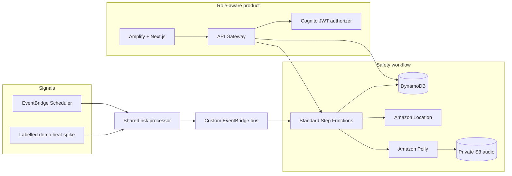

<div align="center">

# TaapSaathi

### Heat safety that keeps people protected and deliveries moving.

[](https://github.com/abhinav0singh/TapSaathi/actions/workflows/web.yml)
[](https://github.com/abhinav0singh/TapSaathi/actions/workflows/backend.yml)
[](https://main.d6hf0wv24qbik.amplifyapp.com)
[](https://aws.amazon.com/)

[**Open the live product**](https://main.d6hf0wv24qbik.amplifyapp.com) · [Judge demo](docs/JUDGE_DEMO_RUNBOOK.md) · [Verification evidence](docs/AWS_VERIFICATION_EVIDENCE.md) · [Deployment guide](docs/DEPLOYMENT_RUNBOOK.md)

</div>


## The problem

Delivery riders work through rising heat, traffic, and time pressure. A weather alert alone does not answer the operational questions that follow:

- Which rider is at risk **right now**?
- Where is the nearest safe rest point?
- What happens to an active delivery while the rider rests?
- Who follows up if the rider does not respond?
- Can every decision be explained afterward?

TaapSaathi turns those questions into one durable, role-aware workflow. It detects risk, creates an intervention, prepares route and voice guidance, secures the delivery, waits for a human response, and escalates when needed.

## What you can see in the live demo

| Experience | What it proves |
| --- | --- |
| **Operations command center** | Live rider states, map positions, intervention routes, delivery ownership, and an audit timeline |
| **Rider safety screen** | Bilingual guidance, route-to-rest context, audio guidance, and explicit break or symptom responses |
| **Supervisor response desk** | Authenticated escalation review and acknowledgment without automatically clearing the rider |
| **Demo controls** | A labelled heat spike enters the same risk pipeline as scheduled observations |

> [!TIP]
> Start at the [public landing page](https://main.d6hf0wv24qbik.amplifyapp.com), then open the live command center. State-changing demo controls require the configured Cognito role.

## The safety loop

1. **Sense** — scheduled weather and demo observations call the same deterministic risk processor.
2. **Decide** — the risk engine publishes a versioned `HeatRiskRaised` event to EventBridge.
3. **Guide** — Standard Step Functions creates a durable intervention while Amazon Location and Polly prepare route and voice guidance.
4. **Protect** — DynamoDB transactions secure active work before reassignment or escalation.
5. **Confirm** — Cognito-backed rider and supervisor responses advance the workflow with an audit trail.
6. **Recover safely** — generation isolation prevents an old workflow or callback from corrupting a reset demo.

## Architecture



The heat-spike endpoint does **not** start Step Functions directly. Scheduled and demo observations both call the shared risk processor and publish the same event contract.

## AWS services and responsibilities

| Service | Responsibility |
| --- | --- |
| AWS Amplify + Next.js | Public story, operations dashboard, rider experience, supervisor desk |
| Amazon Cognito | Operator, worker, and supervisor identity |
| API Gateway HTTP API | Public reads and protected state-changing routes |
| EventBridge | Scheduled observations and the versioned heat-risk event bus |
| Standard Step Functions | Durable waits, callbacks, escalation, and completion |
| DynamoDB | Workers, deliveries, interventions, audit events, idempotency, and demo generation |
| Amazon Location | Route geometry and rest-point guidance |
| Amazon Polly + private S3 | Bilingual voice guidance and protected audio |
| CloudWatch + X-Ray | Metrics, structured logs, traces, and operational evidence |

## Verification snapshot

| Check | Status |
| --- | --- |
| TypeScript across the monorepo | ✅ Pass |
| Vitest | ✅ 22 files, 139 tests |
| CDK synthesis and state-machine validation | ✅ Pass |
| Next.js production build | ✅ Pass |
| Break and symptom workflows in deployed AWS | ✅ Pass |
| Worker and supervisor timeout paths | ✅ Pass |
| Duplicate event/callback protection | ✅ Pass |
| Wrong-role and missing-token rejection | ✅ Pass |
| Reset during an in-flight workflow | ✅ Pass |
| Three-role Cognito browser evidence | ⏳ In progress — [issue #8](https://github.com/abhinav0singh/TapSaathi/issues/8) |

Detailed execution identifiers and verification boundaries live in [AWS verification evidence](docs/AWS_VERIFICATION_EVIDENCE.md).

## Run locally

Node.js 22 or newer is required.

```bash
git clone https://github.com/abhinav0singh/TapSaathi.git
cd TapSaathi
npm ci
npm run typecheck
npm run test
npm --workspace apps/web run dev
```

For infrastructure and deployed verification:

```bash
npm run synth
npm run verify:definition
npm --workspace apps/web run build
```

See the [deployment runbook](docs/DEPLOYMENT_RUNBOOK.md) for AWS profiles, frontend origins, environment values, smoke tests, and rollback guidance.

## Repository map

```text
apps/web/              Next.js landing, operator, rider, supervisor, and login experiences
infra/                 AWS CDK stack and infrastructure assertions
packages/contracts/    shared Zod contracts
services/api/          dashboard, worker, event, and callback APIs
services/demo/         authenticated heat-spike, reset, and seed handlers
services/intervention/ Step Functions task handlers
services/risk-engine/  deterministic heat-risk policy and publisher
services/shared/       authorization, DynamoDB, logging, and HTTP helpers
services/weather/      scheduled weather adapter
scripts/               deployed smoke and state-machine validation
docs/                  specifications, runbooks, evidence, and limitations
```

## Demo scope

TaapSaathi is a single-hub hackathon demonstration using simulated weather, locations, workers, and deliveries. It does not make medical claims or contact emergency services. Read-only demo views are public; state-changing routes require Cognito authorization and server-side identity mapping.

Read [known limitations](docs/KNOWN_LIMITATIONS.md) before treating the design as a production deployment.

## Project documentation

- [Current project status](docs/PROJECT_STATUS.md)
- [Verification status](docs/VERIFICATION_STATUS.md)
- [AWS verification evidence](docs/AWS_VERIFICATION_EVIDENCE.md)
- [Timeout escalation evidence](docs/AWS_TIMEOUT_ESCALATION_VERIFICATION.md)
- [Judge demo runbook](docs/JUDGE_DEMO_RUNBOOK.md)
- [Known limitations](docs/KNOWN_LIMITATIONS.md)

---

<div align="center">
Built to make worker safety an operational decision, not a notification.
</div>
