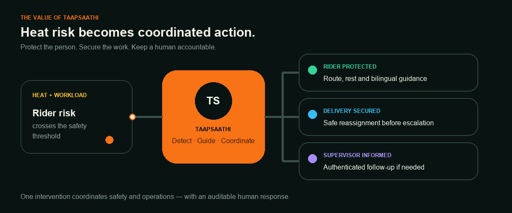
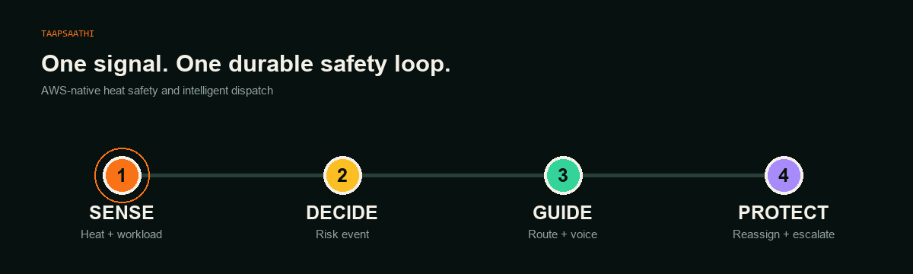
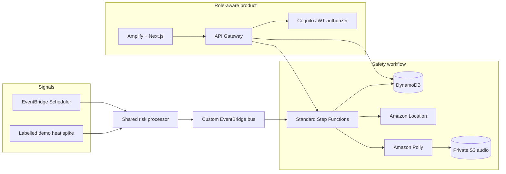

<div align="center">

# TaapSaathi

### When heat puts a rider at risk, TaapSaathi turns the warning into coordinated action.

[](https://github.com/abhinav0singh/TapSaathi/actions/workflows/web.yml)
[](https://github.com/abhinav0singh/TapSaathi/actions/workflows/backend.yml)
[](https://main.d6hf0wv24qbik.amplifyapp.com)
[](https://aws.amazon.com/)

[**Open the live product**](https://main.d6hf0wv24qbik.amplifyapp.com) · [Judge demo](docs/JUDGE_DEMO_RUNBOOK.md) · [Verification evidence](docs/AWS_VERIFICATION_EVIDENCE.md) · [Deployment guide](docs/DEPLOYMENT_RUNBOOK.md)

</div>



## What TaapSaathi does

**TaapSaathi is a heat-safety intervention and dispatch coordination system for delivery operations.** When heat and workload put a rider at risk, it creates a durable intervention, guides the rider toward safety, protects the active delivery, and brings in an authenticated supervisor when a human response is needed.

> **Heat risk → rider guidance → delivery continuity → supervisor accountability**

It closes the gap between detecting danger and acting on it. One intervention coordinates the rider, the delivery, and the operations team while recording every decision in an auditable timeline.

## The value it creates

| For | TaapSaathi provides | Why it matters |
| --- | --- | --- |
| **Riders** | Timely route-to-rest, bilingual text and voice guidance, and a clear way to report symptoms or take a break | Less uncertainty when every minute in the heat matters |
| **Operations teams** | A live map, rider state, delivery ownership, and safe reassignment in one command center | Safety action and delivery continuity stay connected |
| **Supervisors** | Authenticated escalation with the context needed to follow up | Human attention goes to interventions that need it most |
| **Organizations** | A durable, role-aware record of risk, responses, timeouts, and decisions | The response is explainable, testable, and accountable |

## The problem it solves

Delivery riders work through changing heat, traffic, and time pressure. A weather alert can identify a hot day, but it does not complete the response:

- Which rider is at risk **right now**?
- Where is the nearest safe rest point?
- What happens to an active delivery while the rider rests?
- Who follows up if the rider does not respond?
- Can the delivery continue safely?
- Can every decision be explained afterward?

TaapSaathi connects those decisions in one workflow. Safety becomes an operational action instead of a notification that someone still has to interpret and coordinate manually.

## Product features

| Feature | What it does |
| --- | --- |
| **Live operations map** | Shows rider positions, current safety state, rest routes, active interventions, and delivery ownership |
| **Shared heat-risk engine** | Processes scheduled weather observations and labelled demo heat spikes through the same deterministic policy |
| **Rider safety guidance** | Delivers bilingual instructions, route context, rider-authorized short-lived audio, explicit break or symptom responses, and an auditable return-to-work action after a completed break |
| **Delivery protection** | Secures active work before reassignment so a safety intervention does not create ambiguous ownership |
| **Human escalation** | Uses durable waits and authenticated supervisor acknowledgment when a rider does not respond |
| **Auditable recovery** | Records the intervention timeline and isolates demo generations so stale callbacks cannot corrupt a reset |

## What the live demo proves

| Experience | What it proves |
| --- | --- |
| **Operations command center** | Live rider states, map positions, intervention routes, delivery ownership, and an audit timeline |
| **Rider safety screen** | Bilingual guidance, route-to-rest context, audio guidance, and explicit break or symptom responses |
| **Supervisor response desk** | Authenticated escalation review and acknowledgment without automatically clearing the rider |
| **Demo controls** | A labelled heat spike enters the same risk pipeline as scheduled observations |

> [!TIP]
> Start at the [public landing page](https://main.d6hf0wv24qbik.amplifyapp.com), then open the live command center. State-changing demo controls require the configured Cognito role.

## How an intervention works



1. **Sense** — scheduled weather and demo observations call the same deterministic risk processor.
2. **Decide** — the risk engine publishes a versioned `HeatRiskRaised` event to EventBridge.
3. **Guide** — Standard Step Functions creates a durable intervention while Amazon Location and Polly prepare route and voice guidance.
4. **Protect** — DynamoDB transactions secure active work before reassignment or escalation.
5. **Confirm** — Cognito-backed rider and supervisor responses advance the workflow with an audit trail.
6. **Return safely** — after a normal break, the rider can resume as `SAFE` with continuous active minutes reset while the reassigned delivery stays with its new rider.
7. **Recover safely** — generation isolation prevents an old workflow or callback from corrupting a reset demo.

## Architecture



The heat-spike endpoint does **not** start Step Functions directly. Scheduled and demo observations both call the shared risk processor and publish the same event contract.

## AWS services and responsibilities

| Service | Responsibility |
| --- | --- |
| AWS Amplify + Next.js | Public story, operations dashboard, rider experience, supervisor desk |
| Amazon Cognito | Operator, worker, and supervisor identity |
| API Gateway HTTP API | Public operational reads; JWT-protected state changes and rider-specific audio |
| EventBridge | Scheduled observations and the versioned heat-risk event bus |
| Standard Step Functions | Durable waits, callbacks, escalation, and completion |
| DynamoDB | Workers, deliveries, interventions, audit events, idempotency, and demo generation |
| Amazon Location | Route geometry and rest-point guidance |
| Amazon Polly + private S3 | Bilingual voice guidance and protected audio |
| CloudWatch + X-Ray | Metrics, structured logs, traces, and operational evidence |

## Verification snapshot

| Check | Status |
| --- | --- |
| TypeScript across the monorepo | ✅ Pass |
| Unit tests | ✅ 180 tests |
| CDK synthesis and state-machine validation | ✅ Pass |
| Next.js production build | ✅ Pass |
| Deployed v2 take-break and symptom workflows | ✅ Recorded in [golden-path evidence](docs/GOLDEN_PATH_EVIDENCE.md) |
| v2 timeout, duplicate replay, stale callback after reset | ⏳ Not yet re-verified; do not treat earlier-policy evidence as v2 proof |
| Wrong-role and missing-token rejection | ⏳ Needs fresh browser/API evidence on this release |
| Protected rider audio | ✅ Deployed: matching rider `200`; operator, supervisor, and cross-rider requests `403` |
| Reset during an in-flight workflow | ⏳ Needs fresh v2 evidence |
| Three-role Cognito browser evidence | ⏳ In progress — [issue #8](https://github.com/abhinav0singh/TapSaathi/issues/8) |

Detailed execution identifiers and verification boundaries live in [AWS verification evidence](docs/AWS_VERIFICATION_EVIDENCE.md).

## Run locally

Node.js 22 or newer is required.

```bash
git clone https://github.com/abhinav0singh/TapSaathi.git
cd TapSaathi
npm ci
npm run build --workspace=@taapsaathi/contracts
npm run typecheck
npm run test
npm --workspace apps/web run dev
```

For infrastructure and deployed verification:

```bash
npm run synth
npm run verify:definition
npm --workspace apps/web run build
```

See the [deployment runbook](docs/DEPLOYMENT_RUNBOOK.md) for AWS profiles, frontend origins, environment values, smoke tests, and rollback guidance.

## Repository map

```text
apps/web/              Next.js landing, operator, rider, supervisor, and login experiences
infra/                 AWS CDK stack and infrastructure assertions
packages/contracts/    shared Zod contracts
services/api/          dashboard, worker, event, and callback APIs
services/demo/         authenticated heat-spike, reset, and seed handlers
services/intervention/ Step Functions task handlers
services/risk-engine/  deterministic heat-risk policy and publisher
services/shared/       authorization, DynamoDB, logging, and HTTP helpers
services/weather/      scheduled weather adapter
scripts/               deployed smoke and state-machine validation
docs/                  specifications, runbooks, evidence, and limitations
```

## Demo scope

TaapSaathi is a single-hub hackathon demonstration using simulated weather, locations, workers, and deliveries. It does not make medical claims or contact emergency services. Read-only demo views are public; state-changing routes require Cognito authorization and server-side identity mapping.

Read [known limitations](docs/KNOWN_LIMITATIONS.md) before treating the design as a production deployment.

## Project documentation

- [Current project status](docs/PROJECT_STATUS.md)
- [Verification status](docs/VERIFICATION_STATUS.md)
- [AWS verification evidence](docs/AWS_VERIFICATION_EVIDENCE.md)
- [Timeout escalation evidence](docs/AWS_TIMEOUT_ESCALATION_VERIFICATION.md)
- [Judge demo runbook](docs/JUDGE_DEMO_RUNBOOK.md)
- [Known limitations](docs/KNOWN_LIMITATIONS.md)

---

<div align="center">
Built to make worker safety an operational decision, not a notification.
</div>
