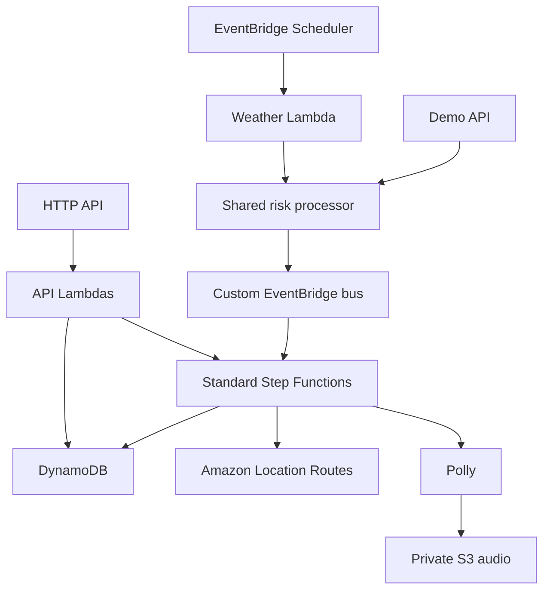

# TaapSaathi — Heat Safety & Intelligent Dispatch

**Engineering update (9 October 2026):** Worker-concurrency and terminal-state hardening implemented locally. AWS redeployment and golden-path verification pending. [Post-critique engineering progress](docs/POST_CRITIQUE_PROGRESS.md)

**Project status:** AWS backend deployed | Live operations dashboard working | Rider experience in testing

[View current development progress](docs/PROJECT_STATUS.md)

[Frontend source](apps/web) | [API specification](docs/openapi.yaml) | [Deployment runbook](docs/DEPLOYMENT_RUNBOOK.md)

## Backend architecture

TaapSaathi is an event-driven heat-safety and dispatch demonstration for delivery workers. A deterministic policy turns a labelled heat observation into a real EventBridge event, a Standard Step Functions intervention, Amazon Location guidance, Polly audio, a one-time human callback, and an auditable DynamoDB reassignment or escalation.

This repository contains the AWS backend, infrastructure, and Next.js frontend. It does not make medical claims, contact emergency services, or represent simulated weather/rest points as live data.

## Status

| Verification layer | Status | Evidence |
| --- | --- | --- |
| Code complete | See current handoff | Source and tests in this repository |
| Local verification | Run commands below | Never infer pass from source presence |
| AWS verification | Pending until deployed | Record real stack outputs and execution ARNs in the release table |

## Architecture



The demo endpoint does not start Step Functions. Scheduled and demo observations call `evaluateAndPublishObservation`, which invokes the same deterministic policy and publishes the same versioned `HeatRiskRaised` envelope to EventBridge.

## Repository layout

```text
infra/                 CDK stack and assertion tests
packages/contracts/    shared Zod API, event, and entity contracts
services/api/          query and callback HTTP handlers
services/demo/         heat-spike, reset, and deployment seed handlers
services/intervention/ Step Functions task handlers
services/risk-engine/  pure deterministic policy and observation processor
services/shared/       DynamoDB adapter, in-memory test double, logging, HTTP helpers
services/weather/      scheduled weather adapter
scripts/               deployed smoke and definition verification
docs/                  OpenAPI and AWS runbook
```

## Local verification

Node.js 22 is required.

```bash
npm install
npm run test:risk:zero-dependency
npm run typecheck
npm run test:unit
npm run test:infra
npm run synth
npm run verify:definition
```

`npm install` creates the lockfile. Commit `package-lock.json` before deployment. Do not mark these commands passed unless their actual output is retained.

## Safe AWS deployment

Use an AWS CLI profile or IAM Identity Center. Do not paste access keys into source files, shell history, or chat.

```bash
aws configure sso --profile taapsaathi-dev
aws sts get-caller-identity --profile taapsaathi-dev
export AWS_PROFILE=taapsaathi-dev
export AWS_REGION=ap-south-1
npx cdk bootstrap aws://ACCOUNT_ID/ap-south-1
npm run synth
npm run deploy
```

Retrieve—not invent—the deployed outputs:

```bash
aws cloudformation describe-stacks \
  --stack-name TaapSaathiStack \
  --region ap-south-1 \
  --profile taapsaathi-dev \
  --query 'Stacks[0].Outputs' \
  --output table
```

Continue with [AWS deployment and evidence runbook](docs/DEPLOYMENT_RUNBOOK.md).

The exact implementation-environment results are recorded in [verification status](docs/VERIFICATION_STATUS.md).

## API contract

- Runtime Zod schemas: `packages/contracts/src`
- Machine-readable description: `docs/openapi.yaml`
- JSON uses camelCase and UTC ISO-8601 timestamps.
- Callback task tokens and private S3 paths are never returned by an API.

## Release evidence

Fill this table only from real deployed results:

| Gate | Result | Evidence |
| --- | --- | --- |
| EventBridge → Step Functions → DynamoDB | AWS VERIFICATION PENDING | execution ARN + queried item |
| Duplicate protection | AWS VERIFICATION PENDING | replay output + unchanged intervention count |
| Golden break path ×3 | AWS VERIFICATION PENDING | three execution ARNs |
| Symptom escalation | AWS VERIFICATION PENDING | execution ARN + audit record |
| Timeout escalation | AWS VERIFICATION PENDING | execution ARN + audit record |
| Location scooter route | AWS VERIFICATION PENDING | persisted `provider: AMAZON_LOCATION` route |
| Hindi Polly audio/private S3 | AWS VERIFICATION PENDING | object metadata + presigned GET result |
| Reset/stale generation | AWS VERIFICATION PENDING | old callback rejection + clean new state |

## Cost and teardown

The stack uses on-demand DynamoDB, Lambda, HTTP API, Step Functions, EventBridge Scheduler, Location, Polly, S3, CloudWatch, and X-Ray. These can incur charges. Logs expire after one week and generated audio after seven days.

```bash
npm run destroy -- --profile taapsaathi-dev
```

Destroying the development stack deletes demo DynamoDB and S3 data. Confirm the stack name and account before running the command.
