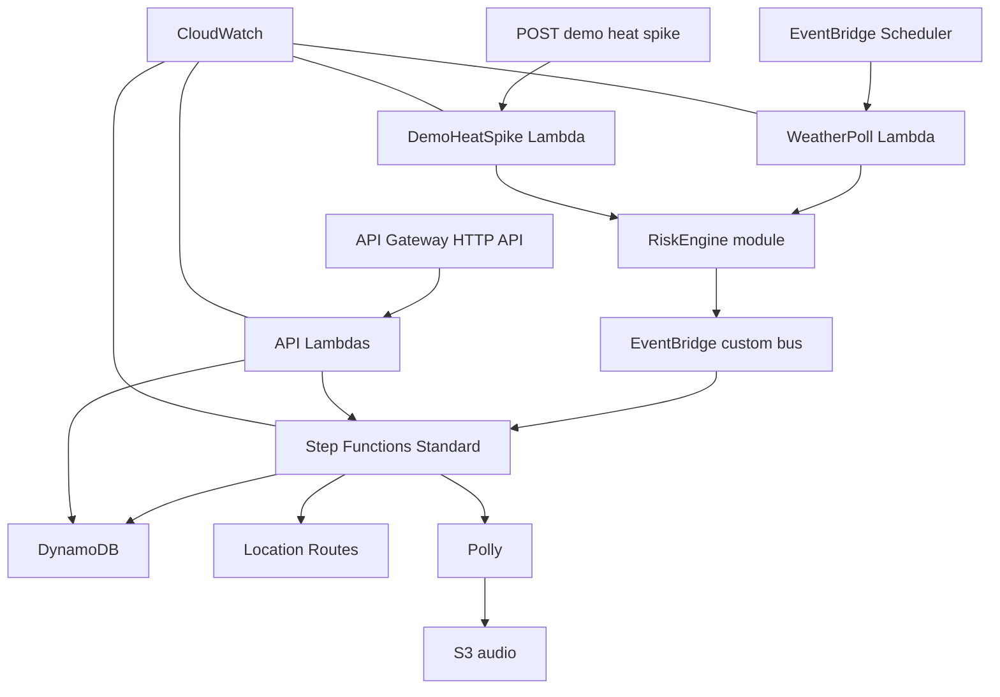
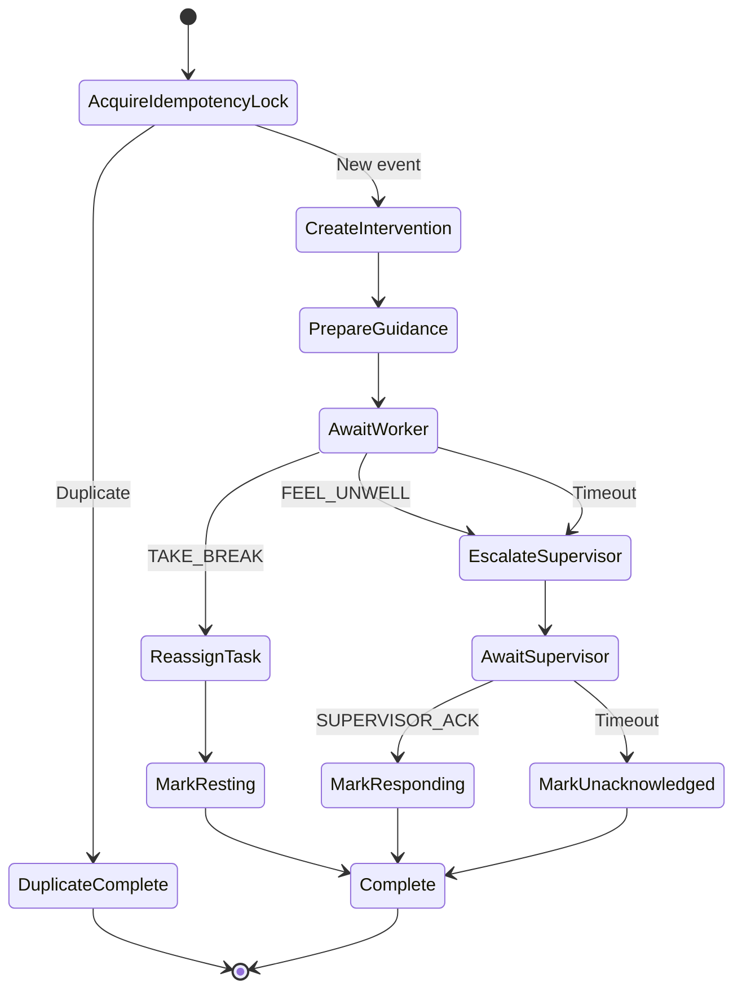

# TaapSaathi Backend Software Design Specification

**Audience:** Backend and cloud developer  
**Status:** Final implementation specification  
**Governing document:** `PRD.md`  
**Primary objective:** Prove a real, event-driven AWS intervention that is deterministic, auditable, idempotent, and repeatable.

## 1. Scope and ownership

The backend owner is responsible for:

- AWS CDK infrastructure;
- API Gateway and Lambda handlers;
- shared request, response, and event schemas;
- DynamoDB design and seed/reset behavior;
- EventBridge Scheduler and custom event bus;
- deterministic risk engine;
- Step Functions intervention workflow;
- Amazon Location route calculation;
- Amazon Polly speech generation and S3 caching;
- delivery reassignment;
- CloudWatch logs and alarms;
- deployment scripts, tests, and runbook.

The backend is authoritative for risk state, task ownership, workflow state, route result, response acceptance, and audit history.

## 2. Technology decisions

| Concern | Decision |
| --- | --- |
| Infrastructure as code | AWS CDK v2 with TypeScript |
| Region | `ap-south-1` unless a required feature proves unavailable |
| Lambda runtime | `nodejs22.x` |
| SDK | Explicitly bundled AWS SDK for JavaScript v3 clients |
| API | API Gateway HTTP API |
| Workflow | AWS Step Functions Standard |
| Event routing | EventBridge custom event bus |
| Scheduling | EventBridge Scheduler, not legacy scheduled rules |
| Persistence | One DynamoDB table with TTL and one GSI |
| Route provider | Amazon Location Service Routes `CalculateRoutes` with `Scooter` travel mode |
| Voice | Amazon Polly bilingual Hindi or Indian English voice |
| Audio | Private S3 bucket with short-lived signed URLs |
| Validation | Zod schemas exported from `packages/contracts` |
| Unit and contract tests | Vitest |
| End-to-end smoke | TypeScript or Bash script plus AWS SDK/HTTP requests |

AWS Lambda currently supports `nodejs22.x`; EventBridge Scheduler is the recommended scheduling service; Step Functions Standard supports callback tasks; and Amazon Location Routes supports scooter routing. These choices are recorded in `PRD.md` sources.

## 3. Repository structure

```text
infra/
├── bin/app.ts
├── lib/taapsaathi-stack.ts
└── test/stack.test.ts

services/
├── api/
│   ├── dashboard.ts
│   ├── worker.ts
│   ├── events.ts
│   ├── respond.ts
│   └── health.ts
├── weather/
│   └── poll-weather.ts
├── risk-engine/
│   ├── evaluate-risk.ts
│   └── handler.ts
├── intervention/
│   ├── create.ts
│   ├── prepare-guidance.ts
│   ├── register-callback.ts
│   ├── reassign-task.ts
│   ├── escalate.ts
│   └── complete.ts
└── demo/
    ├── heat-spike.ts
    ├── reset.ts
    └── seed.ts

packages/contracts/
├── api.ts
├── events.ts
├── entities.ts
└── index.ts
```

## 4. Deployment topology



Use one CDK stack during the hackathon. Multiple stacks add deployment order and output-management risk without improving the demonstration.

## 5. Environment configuration

Required configuration:

| Variable | Purpose |
| --- | --- |
| `TABLE_NAME` | DynamoDB table |
| `EVENT_BUS_NAME` | TaapSaathi custom bus |
| `STATE_MACHINE_ARN` | Intervention workflow |
| `AUDIO_BUCKET_NAME` | Polly output cache |
| `WEATHER_MODE` | `live`, `cached`, or `demo` |
| `WEATHER_ENDPOINT` | Weather-adapter endpoint |
| `MAX_CONTINUOUS_MINUTES` | Configurable operational policy threshold |
| `WORKER_RESPONSE_TIMEOUT_SECONDS` | Short demo timeout; production value differs |
| `SUPERVISOR_RESPONSE_TIMEOUT_SECONDS` | Short demo timeout; production value differs |
| `DEMO_HUB_ID` | Known reset target |

Secrets must not be committed. Open-Meteo may be used for a no-key live-weather adapter; the adapter must be isolated so another provider can replace it.

## 6. Domain contracts

All external payloads and stored event envelopes are validated with shared schemas.

### 6.1 Heat observation

```ts
interface HeatObservation {
  schemaVersion: 1;
  observationId: string;
  source: "LIVE_WEATHER" | "CACHED_WEATHER" | "DEMO_SIMULATOR";
  hubId: string;
  temperatureC: number;
  relativeHumidity: number;
  apparentTemperatureC: number;
  officialHeatAlert: boolean;
  observedAt: string;
}
```

### 6.2 Heat-risk event

```ts
interface HeatRiskRaised {
  schemaVersion: 1;
  eventId: string;
  eventType: "HeatRiskRaised";
  source: HeatObservation["source"];
  hubId: string;
  workerId: string;
  shiftId: string;
  riskLevel: "HIGH" | "CRITICAL";
  matchedRule: string;
  temperatureC: number;
  apparentTemperatureC: number;
  activeMinutes: number;
  idempotencyKey: string;
  occurredAt: string;
}
```

EventBridge envelope:

```json
{
  "Source": "taapsaathi.risk-engine",
  "DetailType": "HeatRiskRaised",
  "EventBusName": "taapsaathi-events",
  "Detail": "<serialized HeatRiskRaised>"
}
```

## 7. Deterministic risk engine

The risk engine is a pure function and has no network or database dependency.

```ts
interface RiskInput {
  officialHeatAlert: boolean;
  temperatureC: number;
  apparentTemperatureC: number;
  relativeHumidity: number;
  activeMinutes: number;
  maxContinuousMinutes: number;
  symptomReported: boolean;
}

interface RiskDecision {
  state: "SAFE" | "CAUTION" | "HIGH" | "CRITICAL";
  matchedRule: string;
  recommendedAction: "CONTINUE" | "PREPARE_BREAK" | "TAKE_BREAK" | "ESCALATE";
  evidence: Record<string, string | number | boolean>;
}
```

Evaluation order:

1. `symptomReported === true` → `CRITICAL`, `WORKER_REPORTED_SYMPTOM`.
2. `officialHeatAlert && activeMinutes >= maxContinuousMinutes` → `HIGH`, `HEAT_ALERT_WITH_ACTIVE_EXPOSURE`.
3. `officialHeatAlert` → `CAUTION`, `OFFICIAL_HEAT_ALERT`.
4. Otherwise → `SAFE`, `NO_POLICY_MATCH`.

If the team adds an apparent-temperature threshold, it must be configured and tested rather than embedded in UI code. The risk engine does not diagnose illness.

## 8. EventBridge design

### 8.1 EventBridge Scheduler

Create a five-minute schedule targeting `WeatherPollLambda`.

Responsibilities:

1. Load active hubs and shifts.
2. Fetch live weather once per hub.
3. Store the raw observation and source.
4. Evaluate each active worker.
5. Publish `HeatRiskRaised` only for `HIGH` or `CRITICAL` decisions.

Configure retry and a dead-letter queue if implementation time permits. At minimum, log failed weather calls and preserve the last known observation as stale rather than silently using it as current.

### 8.2 Custom event bus

Bus name: `taapsaathi-events`.

Rule pattern:

```json
{
  "source": ["taapsaathi.risk-engine"],
  "detail-type": ["HeatRiskRaised"]
}
```

Target: intervention Step Functions state machine.

The demo endpoint does not call Step Functions directly. It passes a simulated observation through the risk-engine module and publishes the same event to the same bus.

## 9. Step Functions workflow

Use a Standard workflow because the design waits for human responses.



### 9.1 State responsibilities

| State | Responsibility |
| --- | --- |
| `AcquireIdempotencyLock` | Conditional DynamoDB put keyed by `idempotencyKey`. |
| `CreateIntervention` | Persist intervention and audit event. |
| `PrepareGuidance` | In parallel, calculate nearest route and generate/cached speech. |
| `AwaitWorker` | Invoke callback-registration Lambda with task token and timeout. |
| `ReassignTask` | Select eligible rider and conditionally update task ownership. |
| `MarkResting` | Set original rider and intervention states. |
| `EscalateSupervisor` | Create urgent supervisor action and audit event. |
| `AwaitSupervisor` | Register supervisor task token and wait for acknowledgement. |
| `Complete` | Write final status and completion event. |

### 9.2 Callback-token flow

1. Step Functions uses `LambdaInvoke` with `WAIT_FOR_TASK_TOKEN`.
2. The registration Lambda stores the task token in the intervention item with an expiration time.
3. The response endpoint verifies that the intervention is awaiting the requesting actor.
4. The endpoint conditionally marks the response as consumed.
5. The endpoint calls `SendTaskSuccess` with the validated action.
6. A second response receives `409 ALREADY_RESPONDED` and never reuses the token.

Task tokens never appear in the browser, application logs, or API responses.

## 10. DynamoDB design

Table name: `TaapSaathi` plus environment suffix.

Primary key:

- partition key: `PK`
- sort key: `SK`

GSI1:

- partition key: `GSI1PK`
- sort key: `GSI1SK`

TTL attribute: `expiresAt`.

### 10.1 Item patterns

| Entity | PK | SK | GSI purpose |
| --- | --- | --- | --- |
| Worker | `WORKER#{workerId}` | `PROFILE` | `HUB#{hubId}` / `STATE#{state}#WORKER#{workerId}` |
| Shift | `WORKER#{workerId}` | `SHIFT#{shiftId}` | `HUB#{hubId}` / `SHIFT#{startedAt}` |
| Task | `TASK#{taskId}` | `META` | `HUB#{hubId}` / `TASK#{status}#{taskId}` |
| Intervention | `INTERVENTION#{id}` | `META` | `HUB#{hubId}` / `INTERVENTION#{createdAt}` |
| Audit event | `INTERVENTION#{id}` | `EVENT#{createdAt}#{eventId}` | none |
| Callback | `INTERVENTION#{id}` | `CALLBACK#{actor}` | none; includes TTL |
| Idempotency lock | `IDEMPOTENCY#{idempotencyKey}` | `LOCK` | none; includes TTL |
| Rest point | `RESTPOINT#{id}` | `META` | `HUB#{hubId}` / `RESTPOINT#{id}` |
| Weather snapshot | `HUB#{hubId}` | `WEATHER#{observedAt}` | none; includes TTL |

### 10.2 Write rules

- Use conditional put for idempotency lock.
- Use conditional update for task reassignment: current assignee and current status must still match expected values.
- Use transactional write when changing task assignee and both worker states if implementation remains manageable.
- Store audit event in the same operation or immediately after, and surface failure.
- Use TTL for callback tokens, location snapshots, weather observations, and idempotency locks.

## 11. Task reassignment

The hackathon algorithm must be deterministic.

Eligible worker:

- belongs to the same hub;
- is on an active shift;
- state is `SAFE`;
- has no urgent active intervention;
- does not already own the maximum configured demo workload.

Ranking:

1. fewest active tasks;
2. lowest active minutes;
3. stable alphabetical `workerId` tie-breaker.

The hackathon does not need route optimization for the new assignee. The deterministic selection must be explainable and testable.

## 12. Amazon Location integration

Input:

- rider origin coordinates;
- each seeded rest-point coordinate;
- `TravelMode: Scooter`.

Process:

1. Calculate routes from the worker to up to three seeded rest points.
2. Select the shortest-duration successful route.
3. Persist destination, distance, duration, and route geometry.
4. Return GeoJSON-compatible geometry to the frontend.

If Amazon Location fails, record `GUIDANCE_ROUTE_FAILED`, continue the workflow with the nearest seeded point by straight-line distance, and visibly mark route guidance unavailable. Do not claim that fallback as an Amazon Location result.

## 13. Amazon Polly and S3

Use a bilingual voice supporting Hindi and Indian English.

Audio-cache key:

```text
audio/{language}/{messageHash}.mp3
```

Process:

1. Build message from fixed templates and validated values.
2. Hash language and message.
3. Return cached S3 object if it exists.
4. Otherwise call Polly and store the object privately.
5. Return a short-lived signed URL through the worker API.

No user text is sent to an LLM. Do not make the audio bucket public.

## 14. HTTP API

### 14.1 `GET /health`

Returns:

```json
{
  "status": "ok",
  "service": "taapsaathi-api",
  "time": "2026-10-08T10:00:00Z"
}
```

### 14.2 `GET /dashboard`

Returns summary, workers, tasks, active interventions, recent events, and `nextCursor`.

### 14.3 `GET /workers/{workerId}`

Returns the worker view required by the mobile page. Never return task tokens.

### 14.4 `GET /events?after={cursor}`

Returns ordered audit events. Cursor is opaque to the frontend.

### 14.5 `POST /interventions/{id}/respond`

Request:

```json
{
  "actorId": "ravi-001",
  "actorType": "WORKER",
  "action": "TAKE_BREAK",
  "language": "hi",
  "clientRequestId": "uuid"
}
```

Responses:

- `202` response accepted;
- `400` invalid action or payload;
- `404` intervention not found;
- `409` already responded or wrong workflow state;
- `500` callback could not be completed.

### 14.6 `POST /demo/heat-spike`

Requirements:

- use a stable, labelled fixture;
- reset-safe event ids or generation number;
- publish through the risk engine and EventBridge;
- return `202` with `eventId`, `source: DEMO_SIMULATOR`, and `acceptedAt`;
- never call the state machine directly.

### 14.7 `POST /demo/reset`

Requirements:

1. Reject reset while another reset is running.
2. Stop or invalidate active demo executions.
3. Delete only items belonging to `DEMO_HUB_ID`.
4. Recreate three workers, shifts, one active task, and three rest points.
5. Increment `demoGeneration` so old callbacks and events cannot affect the new state.
6. Verify the seeded state before returning `200`.

## 15. Error model

```json
{
  "error": {
    "code": "ALREADY_RESPONDED",
    "message": "This intervention already has a response.",
    "requestId": "api-gateway-request-id"
  }
}
```

Rules:

- Do not expose stack traces, task tokens, table names, or ARNs.
- Log full developer context with correlation identifiers.
- Map conditional-write failures to `409`, not `500`.
- Distinguish stale weather from current weather.
- Do not silently substitute simulated weather for a failed live request.

## 16. Security and privacy

Hackathon baseline:

- least-privilege IAM per Lambda group;
- S3 block-public-access enabled;
- API CORS restricted to the deployed frontend origin where practical;
- API Gateway throttling;
- input validation on every route;
- no secrets or task tokens in logs;
- location and callback data expire with TTL;
- demo endpoints operate only on the demo hub;
- no production personal data.

Cognito is P1. If it is cut, clearly label the deployment as a demonstration environment and never claim production security.

## 17. Observability

All logs use JSON and include relevant identifiers:

```json
{
  "level": "INFO",
  "operation": "CreateIntervention",
  "eventId": "evt-demo-ravi-001",
  "interventionId": "int-001",
  "workerId": "ravi-001",
  "message": "Intervention created"
}
```

Metrics:

- `HeatRiskEventsReceived`
- `InterventionsCreated`
- `DuplicateEventsPrevented`
- `WorkerResponsesAccepted`
- `SupervisorEscalations`
- `ReassignmentsSucceeded`
- `WorkflowFailures`

Create one CloudWatch log query or dashboard view that can be shown in the demo if time permits. Do not spend P0 time on decorative monitoring.

## 18. CDK resources

The CDK stack creates:

- DynamoDB table and GSI;
- private S3 audio bucket;
- EventBridge custom bus and risk-event rule;
- EventBridge Scheduler schedule and execution role;
- Lambda functions with explicit environment variables and IAM grants;
- Step Functions Standard state machine;
- API Gateway HTTP API, routes, integrations, CORS, and stage;
- CloudWatch log groups with short hackathon retention;
- stack outputs for API URL, state-machine ARN, table name, and bucket name.

Do not manually create resources in the console except temporary diagnosis. Any manual fix required for the final demo must be reflected in CDK before submission.

## 19. Backend test requirements

At minimum:

- unit tests for every risk-engine branch;
- unit tests for reassignment eligibility and tie-breaking;
- contract validation tests for all routes and domain events;
- CDK assertion tests confirming the event rule, state machine, table, TTL, and required IAM wiring;
- integration test that publishes an event and observes an intervention;
- duplicate-event integration test;
- callback response and repeated-response test;
- timeout escalation test;
- reset test proving exact seed state;
- deployed golden-path smoke test.

Full cases are defined in `test.md`.

## 20. Backend work order

| Hours | Work and gate |
| --- | --- |
| 0–2 | Freeze contracts, fixture, environment names, and state-machine states. |
| 2–5 | CDK table, event bus, Lambda skeletons, API health route. |
| 5–8 | Event rule starts state machine and writes one intervention. Gate 1 passes. |
| 8–12 | Risk engine, demo heat-spike route, idempotency lock, audit events. |
| 12–18 | Callback registration and rider response branch. |
| 18–24 | Task reassignment, supervisor escalation, and reset. Golden path works once. |
| 24–30 | Location route and Polly audio cache. |
| 30–34 | Integration tests, failure handling, and two consecutive reset runs. |
| 34–40 | Observability, deployment hardening, README evidence. Feature freeze. |
| 40–44 | Support recording and retain a stable deployed stack. |

## 21. Backend stop conditions

Do not add:

- Bedrock;
- IoT hardware;
- WebSockets;
- real SMS;
- multi-tenant architecture;
- complex route optimization;
- additional state machines;
- analytics warehouse;
- containers or ECS;
- production CI/CD beyond the deploy command.

## 22. Backend definition of done

- `cdk deploy` provisions the complete stack without manual dependencies.
- Scheduler and simulator both feed the same risk-engine contract.
- EventBridge starts a real Standard workflow.
- Callback tasks accept exactly one valid response.
- Duplicate events produce exactly one intervention.
- Break acceptance reassigns the task deterministically.
- Symptom and timeout paths create supervisor escalation.
- Location and Polly execute during the golden path.
- Reset restores the exact seed state and invalidates stale work.
- Logs contain correlation identifiers and no secrets.
- All P0 backend tests in `test.md` pass.

