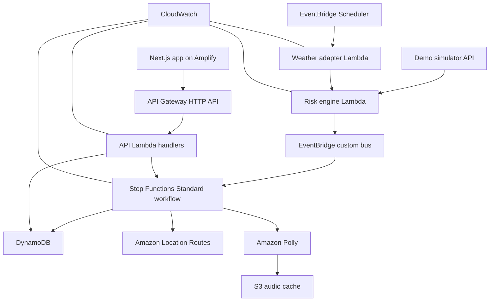

# TaapSaathi Product Requirements Document

**Status:** Final and locked for the hackathon  
**Track:** Heat and Water  
**Build window:** 48 hours  
**Target score:** 28 or more out of 30  
**Product statement:** TaapSaathi converts a heat-risk event into a protected worker break, safe-route guidance, delivery reassignment, human escalation, and an auditable response.

## 1. Decision

The team will build TaapSaathi and will not change the core idea during the hackathon.

TaapSaathi is an event-driven safety and dispatch layer for last-mile delivery operations. It monitors environmental and shift state, applies deterministic rules, and starts an AWS Step Functions intervention without waiting for a supervisor to notice the problem. The web application is the interface to the workflow; it is not the product's decision engine.

The hackathon version proves one complete scenario for one delivery hub, three riders, one supervisor, one active delivery, and three seeded rest points.

## 2. Why a customer would use and pay for it

Weather applications already provide free forecasts and warnings. A fleet operator would not pay for another heat dashboard. The customer pays for the operational response after the warning:

- reassign an at-risk rider's active delivery before it becomes a failed order;
- guide the rider to water or shade;
- escalate symptoms or non-response to a human supervisor;
- record what the system, rider, and supervisor did;
- integrate the workflow with an existing dispatch platform through APIs.

The likely payer is a delivery contractor, logistics fleet operator, platform safety team, municipal field-work contractor, or another organization employing outdoor workers. The rider is the beneficiary, not the paying customer.

The long-term business model is B2B software priced per active worker, delivery hub, or API usage. The hackathon will not claim validated willingness to pay or invented cost savings. It will demonstrate measurable operational outcomes.

## 3. Users

### 3.1 Primary user: shift coordinator

**Persona:** Neha manages 20 to 100 riders from a delivery hub.

**Job to be done:** When environmental conditions become dangerous, Neha needs to know who is affected, whether the rider responded, what happened to the active delivery, and whether further help is required.

**Why she uses the website:** The dashboard combines active-shift state, intervention acknowledgement, task reassignment, and escalation. It replaces coordination across a weather app, calls, chat messages, dispatch software, and manual incident notes.

### 3.2 Secondary user: rider

**Persona:** Ravi is completing an afternoon delivery.

**Job to be done:** Ravi needs a short, understandable recommendation that does not require interpreting weather data.

**Interaction model:** Ravi opens a mobile shift link once. During an intervention he receives Hindi or English text and audio, a route to a rest point, and two large actions: **Take break** and **I feel unwell**.

Ravi does not receive a complex dashboard and is not expected to monitor the website continuously.

## 4. Product principles

1. **Event-driven:** production checks run on an EventBridge Scheduler cadence; the demo simulator publishes the same domain event used by the production path.
2. **Deterministic safety logic:** no LLM decides whether a worker is safe.
3. **Human control:** the system recommends, reassigns, and escalates but does not diagnose or contact emergency services automatically.
4. **Minimal worker interaction:** the rider can understand and respond in one tap.
5. **Auditable:** every rule input and state transition is recorded.
6. **Privacy by default:** location is limited to the active shift and expires through DynamoDB TTL.
7. **Honest demonstration:** all simulated environmental data is labelled as simulated.
8. **One complete workflow:** reliability outranks feature count.

## 5. Scope

### 5.1 Priority zero requirements

| ID | Requirement | Definition of done |
| --- | --- | --- |
| PRD-001 | Operations dashboard | Shows three riders, current states, active tasks, last events, and one selected-rider panel. |
| PRD-002 | Rider mobile view | Supports Hindi and English, audio playback, route summary, and two response actions at a 360-pixel viewport. |
| PRD-003 | Automatic production path | EventBridge Scheduler invokes the weather adapter, which can evaluate stored active shifts without a supervisor click. |
| PRD-004 | Demo heat spike | `POST /demo/heat-spike` publishes a labelled simulated observation through the same risk engine and event contract. |
| PRD-005 | Deterministic policy | Produces `SAFE`, `CAUTION`, `HIGH`, or `CRITICAL` with stored evidence and matched rule. |
| PRD-006 | Event routing | A `HeatRiskRaised` event is delivered through EventBridge to Step Functions. |
| PRD-007 | Intervention workflow | A real Standard Step Functions execution waits for rider response and follows break, symptom, or timeout branches. |
| PRD-008 | Guidance | Amazon Polly produces Hindi or English audio and Amazon Location calculates a scooter route to a seeded rest point. |
| PRD-009 | Delivery reassignment | Accepting a break assigns the active task to the safest available demo rider. |
| PRD-010 | Supervisor escalation | Symptom or timeout creates a supervisor action that can be acknowledged. |
| PRD-011 | Audit timeline | DynamoDB records trigger, matched rule, guidance, rider response, reassignment, escalation, and completion. |
| PRD-012 | Idempotency | Replaying the same event does not create a second intervention or reassignment. |
| PRD-013 | Reliable reset | `POST /demo/reset` restores the exact opening state for all demo entities. |
| PRD-014 | Deployment | A signed-out judge can open the deployed application and run the golden scenario. |
| PRD-015 | Observability | CloudWatch contains searchable logs for the demo execution and errors are visible in the UI. |

### 5.2 Priority one only after every P0 requirement works

- Cognito authentication for supervisor and worker roles
- Browser push notifications
- End-of-shift summary
- Additional hubs or workers
- Offline caching of the worker shell

### 5.3 Explicit non-goals

- Medical diagnosis or heatstroke prediction
- Insurance, payouts, or compensation processing
- Real SMS or WhatsApp delivery
- Wearables or custom IoT hardware
- Native mobile applications
- Machine-learning weather prediction
- LLM-based safety decisions
- Citywide verified cooling-center database
- Replacing a company's existing dispatch system
- More than one polished demo scenario

## 6. Risk policy

The policy engine is a pure, deterministic TypeScript module. It receives environmental state, worker exposure state, and worker input. It returns a risk state, matched rule, recommended action, and evidence.

Inputs:

- official or provider heat-alert flag;
- temperature in Celsius;
- apparent temperature or heat index;
- humidity;
- continuous active minutes;
- last acknowledged rest;
- worker-reported symptom flag.

Rules:

1. A worker-reported symptom immediately returns `CRITICAL`.
2. An active official heat alert combined with the configured maximum continuous work duration returns `HIGH`.
3. A heat alert without exceeded exposure returns `CAUTION`.
4. Conditions below configured thresholds return `SAFE`.

The prototype's duration threshold is configurable and must be described as an operational demo policy, not a medical limit. Inputs and output are written to the audit record. Bedrock or any other LLM is prohibited from this decision path.

## 7. User journeys

### 7.1 Normal shift

1. Neha opens `/ops`.
2. Ravi opens `/worker/ravi-001` and selects Hindi.
3. The system shows Ravi as safe with one active delivery.
4. EventBridge Scheduler continues the automatic weather-check path without creating an intervention.

### 7.2 High-risk break

1. The presenter starts the labelled demo heat spike.
2. The risk engine emits `HeatRiskRaised`.
3. EventBridge starts the intervention state machine.
4. The system creates route and audio guidance.
5. Ravi's screen announces the recommendation in Hindi.
6. Ravi selects **Take break**.
7. The workflow reassigns Ravi's delivery to Asha, the safest eligible rider.
8. The dashboard shows Ravi resting, the new assignee, and the complete event timeline.

### 7.3 Symptom or no response

1. Ravi selects **I feel unwell**, or the response task times out.
2. The workflow creates an urgent supervisor action.
3. Neha selects **I am responding**.
4. The workflow closes as `SUPERVISOR_RESPONDING` and preserves the audit evidence.
5. The interface keeps 112 visible but does not claim to have called it.

## 8. Shared API contract

All frontend fixtures and backend responses import types from `packages/contracts`. The contract uses camelCase JSON and ISO 8601 UTC timestamps.

| Method | Route | Purpose |
| --- | --- | --- |
| `GET` | `/dashboard` | Return summary counts, riders, tasks, active interventions, and event cursor. |
| `GET` | `/workers/{workerId}` | Return the rider's public state, recommendation, route, and intervention without private audio data. |
| `GET` | `/workers/{workerId}/audio` | Return a short-lived audio URL only to the JWT-authenticated mapped rider. |
| `GET` | `/events?after={cursor}` | Return ordered audit events for polling. |
| `POST` | `/interventions/{id}/respond` | Submit `TAKE_BREAK`, `FEEL_UNWELL`, or `SUPERVISOR_ACK`. |
| `POST` | `/demo/heat-spike` | Publish the labelled deterministic demo observation. |
| `POST` | `/demo/reset` | Restore the exact demo seed state. |
| `GET` | `/health` | Return service and dependency status. |

### 8.1 Domain event

```json
{
  "schemaVersion": 1,
  "eventId": "evt-demo-ravi-001",
  "eventType": "HeatRiskRaised",
  "source": "DEMO_SIMULATOR",
  "workerId": "ravi-001",
  "shiftId": "shift-demo-001",
  "riskLevel": "HIGH",
  "matchedRule": "HEAT_ALERT_WITH_ACTIVE_EXPOSURE",
  "temperatureC": 45.2,
  "apparentTemperatureC": 49.1,
  "activeMinutes": 75,
  "idempotencyKey": "shift-demo-001#ravi-001#window-01",
  "occurredAt": "2026-10-08T10:00:00Z"
}
```

Breaking contract changes require updating the shared schema, backend validation, frontend fixture, and contract test in the same commit.

## 9. AWS architecture



Required stack:

- AWS CDK v2 with TypeScript
- Next.js with TypeScript on Amplify Hosting
- API Gateway HTTP API
- Lambda on the `nodejs22.x` runtime
- DynamoDB with TTL and a hub/status GSI
- EventBridge Scheduler plus a custom event bus
- Step Functions Standard
- Amazon Location Service Routes using scooter mode
- Amazon Polly bilingual Hindi and Indian English voice
- S3 private audio cache with short-lived signed access
- CloudWatch logs and alarms

Every service listed above must execute in the golden scenario or be removed from the final architecture claim.

## 10. Frontend requirements

Routes:

- `/ops` — supervisor operations dashboard
- `/worker/[workerId]` — rider intervention screen
- `/demo` — compact reset and scenario controller, or a drawer inside `/ops`

The dashboard must include a rider list, status summary, map, selected-worker panel, active intervention, reassignment result, and audit timeline. The rider screen must include current state, short instruction, route summary, audio replay, **Take break**, **I feel unwell**, and 112.

The UI uses two-second polling during the demo. WebSockets are out of scope. State is never inferred only in the browser; backend state is authoritative.

## 11. Backend requirements

The backend must:

- deploy through CDK with one repeatable command;
- validate every external payload;
- use conditional writes for idempotency;
- store Step Functions task tokens only on the server;
- implement the callback pattern for rider and supervisor response;
- produce structured JSON logs containing `eventId`, `interventionId`, and `workerId`;
- return explicit errors rather than silently falling back to fake success;
- seed and reset demo data deterministically;
- keep production weather ingestion and demo simulation as separate adapters feeding the same risk engine.

## 12. Success metrics

The project will report operational metrics rather than unsupported claims about lives saved:

- seconds from risk event to rider alert;
- seconds from alert to rider acknowledgement;
- interventions acknowledged;
- deliveries successfully reassigned;
- supervisor escalations acknowledged;
- active minutes interrupted by an accepted break;
- duplicate interventions prevented.

## 13. Judging strategy

| Criterion | Weight | Evidence required in the video and repository |
| --- | ---: | --- |
| AWS architecture and integration | 10 | Automatic and simulated ingestion paths, EventBridge event, live Step Functions graph, DynamoDB audit, Location route, Polly audio, CloudWatch logs, and CDK. |
| Idea and Bharat-centric impact | 8 | Indian gig-worker persona, NDMA-aligned problem, Hindi accessibility, and a concrete work outcome. |
| Execution and feasibility | 4 | One deployed end-to-end path, deterministic reset, honest simulation, contract tests, and graceful errors. |
| Demo readiness | 4 | Safe-to-risk transition followed by audio, route, reassignment, and escalation within 150 seconds. |
| UI and accessibility | 4 | Polished supervisor view and one-screen bilingual rider experience that does not depend on color alone. |

## 14. Demo script

| Time | Demonstration |
| --- | --- |
| 0:00–0:20 | Introduce Ravi, Neha, the active delivery, and the problem with passive weather alerts. |
| 0:20–0:40 | Show the automatic Scheduler path in the architecture and explain that the simulator compresses a real heat event. |
| 0:40–1:00 | Trigger the labelled heat spike and show `HeatRiskRaised`. |
| 1:00–1:25 | Show the running Step Functions execution and Ravi's Hindi audio alert. |
| 1:25–1:50 | Ravi accepts a break and receives the Amazon Location route. |
| 1:50–2:10 | The delivery is reassigned to Asha and appears in the audit timeline. |
| 2:10–2:30 | Demonstrate the symptom branch and Neha's acknowledgement. |
| 2:30–2:50 | Show live AWS execution evidence and explain service responsibilities. |
| 2:50–3:00 | Close with intervention time, reassignment, and the product promise. |

## 15. Forty-eight-hour constraints

- API contract frozen by hour 2.
- First deployed EventBridge-to-Step-Functions-to-DynamoDB slice by hour 8.
- Frontend connected to real dashboard data by hour 14.
- Full golden path working once by hour 24.
- Full golden path passing twice after reset by hour 34.
- Feature freeze at hour 40.
- Backup video completed by hour 44.
- Submission completed with at least two hours of contingency.

If authentication is incomplete by hour 14, cut it. If real-time delivery is unstable, keep polling. If the external weather provider is unstable, preserve the automatic adapter but use cached baseline data and the labelled simulator for the recorded scenario. Never cut the event bus, state machine, idempotency, reset, worker response, reassignment, or audit timeline.

## 16. Definition of done

- Every P0 requirement passes on the deployed URL.
- The reset-to-completion scenario passes twice consecutively.
- Duplicate heat events do not duplicate interventions.
- A signed-out user can open the web application and unlisted video.
- The public repository contains CDK, source code, tests, setup, architecture, limitations, and AI-tool attribution.
- The video is under three minutes and visibly proves AWS execution.
- Simulated inputs and seeded locations are labelled.
- No unsupported medical, financial, or commercial claim appears in the product or pitch.

## 17. Sources

- [Bharat Builds Environmental Hacks](https://www.wemakedevs.org/aws/env)
- [Environmental Hacks rules](https://www.wemakedevs.org/aws/env/rules)
- [NDMA heat-wave guidance](https://ndma.gov.in/Natural-Hazards/Heat-Wave)
- [NDMA public heat-wave precautions](https://ndma.gov.in/heatwave)
- [ILO heat-stress report](https://www.ilo.org/publications/major-publications/working-warmer-planet-effect-heat-stress-productivity-and-decent-work)
- [AWS Lambda TypeScript and Node.js runtimes](https://docs.aws.amazon.com/lambda/latest/dg/lambda-typescript.html)
- [EventBridge Scheduler](https://docs.aws.amazon.com/eventbridge/latest/userguide/using-eventbridge-scheduler.html)
- [Step Functions callback pattern](https://docs.aws.amazon.com/step-functions/latest/dg/connect-to-resource.html)
- [Amazon Location Routes](https://docs.aws.amazon.com/location/latest/developerguide/calculate-routes.html)
- [Amazon Polly bilingual voices](https://docs.aws.amazon.com/polly/latest/dg/bilingual-voices.html)

